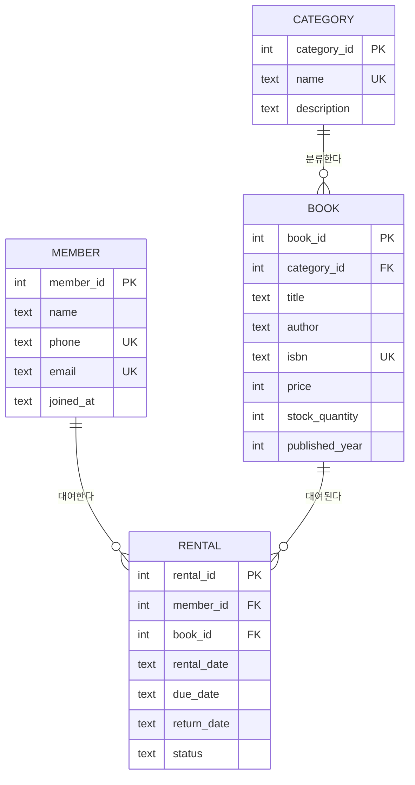

# 도서 대여 관리 데이터베이스 (SQL 미션)

엑셀이 아닌 **관계형 데이터베이스**로 도서관의 분류 · 도서 · 회원 · 대여 기록을 설계하고,
테이블 생성(DDL) → 샘플 데이터 입력(DML) → 요구사항을 SQL로 해결(SELECT/JOIN/GROUP BY/서브쿼리/수정삭제/인덱스)
하는 전체 흐름을 실습한 결과물입니다. 백엔드 프레임워크는 사용하지 않았습니다.

> DB는 **SQLite 3**을 사용했습니다. 로컬에 MySQL이 설치되어 있었지만 root 비밀번호를 분실한 상태였고,
> 서비스 초기화(skip-grant-tables) 같은 위험한 작업 없이 서버/비밀번호 없이 바로 실습할 수 있어
> 과제 안내에서도 입문자에게 추천하는 SQLite로 진행했습니다.

## 1. 주제 & 테이블 구조

주제: **도서 대여 관리** (회원, 도서, 대여 기록, 도서 분류)

| 테이블 | 설명 | PK | FK |
|---|---|---|---|
| `category` | 도서 분류 (소설/자기계발/IT 등) | category_id | - |
| `book` | 도서 | book_id | category_id → category |
| `member` | 회원 | member_id | - |
| `rental` | 대여 기록 (누가 어떤 책을 언제 빌렸는지) | rental_id | member_id → member, book_id → book |

**1:N 관계 3개** (요구사항 최소 2개 충족)
- `category` 1 : N `book`
- `member` 1 : N `rental`
- `book` 1 : N `rental`

### ERD



### 제약조건 요약
- NOT NULL: `book.title/author/price`, `member.name/phone`, `rental.member_id/book_id/rental_date/due_date` 등
- UNIQUE: `category.name`, `book.isbn`, `member.phone`, `member.email`
- FK 무결성: 존재하지 않는 부모 키를 참조하면 삽입이 막힘 (실제 재현 결과: [`results/19_bonus_fk_violation_demo.txt`](results/19_bonus_fk_violation_demo.txt))
- 대여 이력이 있는 회원/도서는 삭제할 수 없도록 `ON DELETE RESTRICT` 적용

### 데이터 설계 포인트: "연체"를 다루는 방법
샘플 데이터에는 반납 기한(`due_date`)이 이미 지났는데도 `status`가 여전히 `'RENTED'`로 남아 있는
대여 건을 일부러 섞어 두었습니다 (배치 작업이 아직 안 돈 상태를 재현). 그래서 연체 여부를 판단할 때
`status` 컬럼만 믿지 않고 실제 데이터인 `return_date IS NULL AND due_date < 오늘` 조건으로 직접 계산하고,
`Q14`에서 이 조건에 맞는 건들을 `UPDATE`로 `'OVERDUE'`로 일괄 정정합니다.

## 2. 폴더 구조 & 제출물

```
sql/
  01_schema.sql   # 스키마 생성 (PK/FK/제약조건 포함, 실행 순서 1번)
  02_seed.sql     # 샘플 데이터 입력 (테이블당 10행 이상, 실행 순서 2번)
  03_queries.sql  # 핵심 쿼리 16개 + 보너스 쿼리 (실행 순서 3번)
results/
  01~16_*.txt     # 필수 쿼리 16개 실행 결과 텍스트 캡처
  17~22_*.txt     # 보너스 쿼리 실행 결과 텍스트 캡처
  README.md       # 결과 파일 목록 인덱스
db/
  library.db      # 위 스크립트로 생성된 SQLite 데이터베이스 파일 (바로 열어서 확인 가능)
scripts/
  build_db.py     # 01_schema.sql + 02_seed.sql 로 db/library.db 를 새로 생성
  run_queries.py  # 03_queries.sql 의 각 쿼리를 실행해 results/*.txt 로 저장
```

## 3. 실행 방법

### (A) VS Code + SQLTools 로 직접 확인 (GUI)
1. 확장 설치: `SQLTools`(mtxr.sqltools), `SQLTools SQLite Driver`(mtxr.sqltools-driver-sqlite) — 이미 `.vscode/settings.json`에 연결 정보(`db/library.db`)가 등록되어 있습니다.
2. VS Code 왼쪽 SQLTools 아이콘 → `library-rental-db (SQLite)` 연결 → `sql/03_queries.sql` 열어서 쿼리 블록 선택 후 실행(Ctrl+E Ctrl+E).

### (B) 커맨드라인 재현 (Python 내장 sqlite3 모듈 사용)
```bash
python scripts/build_db.py     # 스키마+시드로 db/library.db 새로 생성
python scripts/run_queries.py  # 쿼리 22개 실행, results/*.txt 로 결과 저장
```
`run_queries.py`에는 `UPDATE`/`DELETE`/일부러 실패시키는 `INSERT`가 포함되어 있어 DB 상태가 바뀝니다.
다시 깨끗한 상태에서 돌리고 싶다면 `build_db.py`를 먼저 실행하세요.

## 4. 핵심 쿼리 16개 (+보너스) 구성

`sql/03_queries.sql` 기준, 각 쿼리 결과는 `results/` 폴더에 동일한 순서로 저장되어 있습니다.

| # | 구분 | 내용 |
|---|---|---|
| Q1 | 기본조회 | 15000원 이상 도서 가격 높은순 TOP5 (`WHERE`+`ORDER BY`+`LIMIT`) |
| Q2 | 기본조회 | 현재 대여 중인 책 목록 (`WHERE`) |
| Q3 | 기본조회 | 제목에 '사람' 포함 도서 검색 (`LIKE`+`ORDER BY`) |
| Q4 | 기본조회 | 최근 30일 대여 기록 (`WHERE` 날짜 +`ORDER BY`) |
| Q5 | 조인 | 대여기록+회원명 (`INNER JOIN`) |
| Q6 | 조인 | 대여기록+도서+카테고리 3테이블 (`INNER JOIN` x2) |
| Q7 | 조인 | 카테고리별 도서 목록 (`INNER JOIN`) |
| Q8 | 조인 | 대여 0건 회원 포함 전체 회원 대여건수 (`LEFT JOIN`) |
| Q9 | 집계 | 회원별 대여 횟수 (`COUNT`+`GROUP BY`) |
| Q10 | 집계 | 도서별 대여횟수/연체횟수 (`COUNT`+`SUM`+`GROUP BY`) |
| Q11 | 집계 | 카테고리별 평균 정가 (`AVG`+`GROUP BY`) |
| Q12 | 서브쿼리 | 평균가보다 비싼 도서 |
| Q13 | 서브쿼리 | 대여 이력 없는 회원 (`NOT IN`) |
| Q14 | 수정 | 기한 지난 미반납 건 연체로 일괄 업데이트 (`UPDATE`) |
| Q15 | 삭제 | 불필요한 대여 기록 삭제 (`DELETE`) |
| Q16 | 인덱스 | `rental(member_id)`, `rental(book_id)` 인덱스 생성 + 이유 |
| B1-B2 | 보너스 | 같은 요구를 JOIN vs 서브쿼리 두 방식으로 비교 |
| B3 | 보너스 | FK 무결성 위반 재현 및 원인/해결 기록 |
| B4-B6 | 보너스 | 미니 리포트 KPI 3개 (월별 대여 건수 추이 / 인기도서 TOP10 / 연체율 높은 회원) |

## 5. 학습 정리 (과제 목표 자가 점검)

- **엑셀 vs DB**: 엑셀은 시트 하나에 모든 정보를 욱여넣어 중복·불일치가 생기기 쉽지만, DB는 `category`/`book`/`member`/`rental`처럼 역할별로 테이블을 나누고 FK로 "관계"를 명시해 중복 없이 연결한다.
- **PK/FK & 1:N**: `rental.book_id`가 `book.book_id`를 가리키듯, 자식 테이블이 부모 테이블의 PK를 FK로 들고 있으면 부모 1건에 자식 여러 건이 붙는 1:N 관계가 만들어진다.
- **SELECT/INSERT/UPDATE/DELETE**: 조회는 `SELECT`, 새 대여·회원 등록은 `INSERT`, 연체 상태 변경처럼 기존 행 일부를 바꿀 땐 `UPDATE`, 더 이상 필요 없는 기록을 없앨 땐 `DELETE`.
- **JOIN + GROUP BY**: 여러 테이블에 흩어진 정보를 한 행으로 합치는 게 `JOIN`, 합친 결과를 그룹별로 묶어 집계하는 게 `GROUP BY` (Q10 도서별 대여/연체 집계가 대표적 예).
- **인덱스**: FK 컬럼처럼 `WHERE`/`JOIN` 조건으로 자주 쓰이는 컬럼에 인덱스를 걸면 전체 테이블 스캔 없이 빠르게 찾을 수 있다 (Q16).
